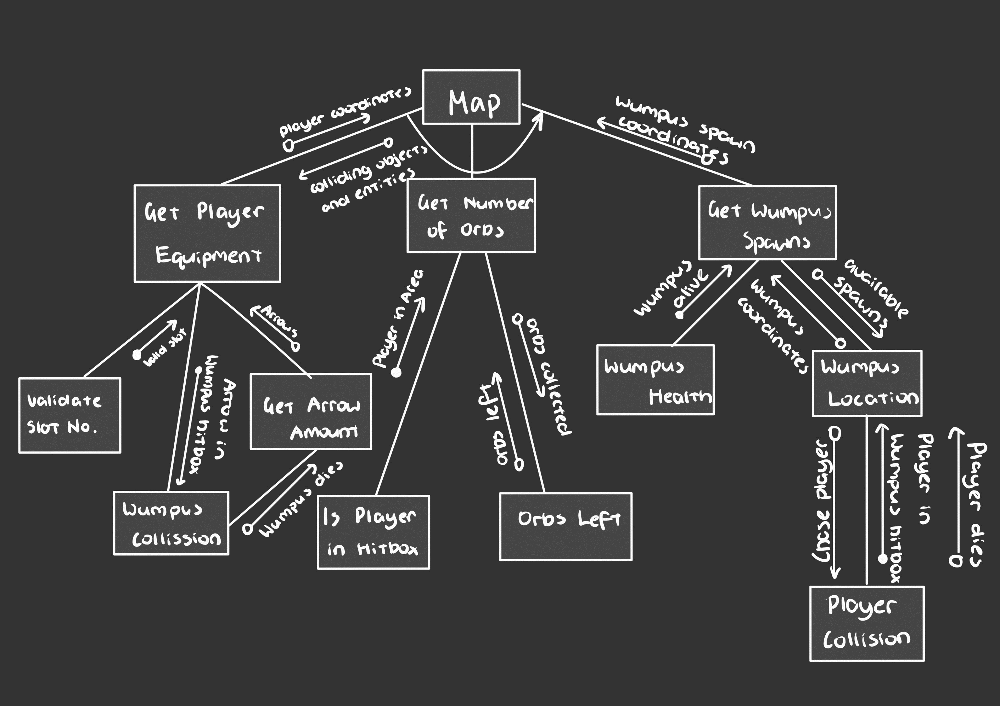

# Year 11 Software Design and Development Assessment Task 2
## Original Basic code
``` Basic
10 DEFINT A-Z: DIM R(19,3),P(1),B(1)
20 FOR I=0 TO 19: READ R(I,0),R(I,1),R(I,2): NEXT
30 INPUT "Enter a number";X: X=RND(-ABS(X))
40 PRINT: PRINT " HUNT THE WUMPUS "
50 PRINT "-----------------------": PRINT
60 FOR I=0 TO 1: GOSUB 500: P(I)=X: GOSUB 500: B(I)=X: NEXT
70 GOSUB 500: W=X: GOSUB 500: P=X
80 A=5
90 IF A=0 THEN 340
100 IF P=W THEN 410
110 IF P=B(0) OR P=B(1) THEN 360
120 IF P=P(0) OR P=P(1) THEN 390
130 PRINT: FOR I=0 TO 2
140 IF R(P,I)=W THEN PRINT "You smell something terrible nearby."
150 FOR J=0 TO 1
160 IF R(P,I)=B(J) THEN PRINT "You hear a rustling."
170 IF R(P,I)=P(J) THEN PRINT "You feel a cold wind blowing from a nearby cavern."
180 NEXT J,I
190 PRINT USING "You are in room ##. ";P;
200 PRINT USING "Tunnels lead to ##; ##; and ##.";R(P,0);R(P,1);R(P,2)
210 PRINT USING "You have # arrows.";A: PRINT
220 LINE INPUT "M)ove, S)hoot or Q)uit? ";I$
230 S=I$="S" OR I$="s": IF S OR I$="M" OR I$="m" THEN 260
240 IF I$="Q" OR I$="q" THEN END
250 PRINT "Sorry?": GOTO 220
260 INPUT "Which room";X: PRINT
270 IF X=R(P,0) OR X=R(P,1) OR X=R(P,2) THEN IF S THEN 290 ELSE P=X: GOTO 90
280 PRINT "Cannot get there from here.": GOTO 260
290 IF X=W THEN PRINT "Congratulations! You shot the wumpus!": GOTO 440
300 PRINT "You missed.": A=A-1: IF RND(1)<.25 THEN 90
310 PRINT "The wumpus wakes from his slumber."
320 X=RND(1)*3: IF R(R(W,X),3) THEN 320
330 R(W,3)=0: W=R(W,X): R(W,3)=1: GOTO 90
340 PRINT "As you grasp at your empty quiver, ";
350 PRINT "you hear a large beast approaching...": GOTO 410
360 PRINT "You have entered the lair of a large bat."
370 PRINT "It picks you up and drops you in room";
380 P=R(P,RND(1)*3): PRINT P;".": GOTO 90
390 PRINT "The ground gives way beneath your feet."
400 PRINT "You fall into a deep abyss.": GOTO 430
410 PRINT "You find yourself face to face with the wumpus."
420 PRINT "It eats you whole."
430 PRINT: PRINT "You have met your demise."
440 LINE INPUT "Another game (Y/N)?";I$
450 IF I$="Y" OR I$="y" THEN 60
460 IF I$<>"N" AND I$<>"n" THEN PRINT "Sorry?": GOTO 440
470 END
500 X=RND(1)*20: IF R(X,3)=0 THEN R(X,3)=1: RETURN ELSE 500
510 DATA 1,4,7, 0,2,9, 1,3,11, 2,4,13, 0,3,5
520 DATA 4,6,14, 5,7,16, 0,6,8, 7,9,17, 1,8,10
530 DATA 9,11,18, 2,10,12, 11,13,19, 3,12,14, 5,13,15
540 DATA 14,16,19, 6,15,17, 8,16,18, 10,17,19, 12,15,18
```

## Annotations
**DEFINT A-Z** is a basic inbuilt function that turns all variables that aren't a string, which are ones that don't have a ***$*** end indicator:
> **10** DEFINT A-Z: DIM R(19,3),P(1),B(1)

The ***For*** Loop collectes integers in an array of ***R***, where its minimum is 0 and maximum is 19 - this establishes each of the 20 room numbers:
> **20** FOR I=0 TO 19: READ R(I,0),R(I,1),R(I,2): NEXT

In line 30, a number can be entered to choose a room, then the code calculates a random number to place the Wumpus into a room that isn't the player's chosen room:
> **30** INPUT "Enter a number";X: X=RND(-ABS(X))

From lines 40-50, the console prints a bare bones screen text of the Wumpus' main title:
> **40** PRINT: PRINT " HUNT THE WUMPUS "
   **50** PRINT "-----------------------": PRINT

From lines 60-70, the code executes a subroutine with a thread sleep time of 500 ms, an array of ***P*** with an index of ***I*** being the actual player, represents the player controller and action of moving one room to another, and creates checks if the Player ***P*** is in the same room as the Wumpus ***W***:
> **60** FOR I=0 TO 1: GOSUB 500: P(I)=X: GOSUB 500: B(I)=X: NEXT
   **70** GOSUB 500: W=X: GOSUB 500: P=X

Line 80 is an initialiser for the amount of arrows you start with:
> **80** A=5

From lines 90-130, the code calculates the player's *room-choosing* decision, where each room the player enters has at most 3 separate tunnels leading to another room, not including the one where the player came from. The numbers of *340, 410, 360 and 390* are indexes/angles for these tunnels. The ***For*** loop in line 130 prints out the room options for the player in the console:
> **90** IF A=0 THEN 340
   **100** IF P=W THEN 410
   **110** IF P=B(0) OR P=B(1) THEN 360
   **120** IF P=P(0) OR P=P(1) THEN 390
   **130** PRINT: FOR I=0 TO 2

From lines 140-180, the code runs an infinite loop (***NEXT J,I***) to check if the Player is in an adjacent room coordinate to the Wumpus, bat or a pit. If these conditions are met the console will print out messages/hints for the player:
> **140** IF R(P,I)=W THEN PRINT "You smell something terrible nearby."
> **150** FOR J=0 TO 1
   **160** IF R(P,I)=B(J) THEN PRINT "You hear a rustling."
   **170** IF R(P,I)=P(J) THEN PRINT "You feel a cold wind blowing from a nearby cavern."
   **180** NEXT J,I

From lines 190-280, for every time the player makes a move into another room, the code prints out the room number and the coordinates of adjacent rooms connected to it. It also displays options of:
- [ ] Move?
- [ ] Shoot?
- [ ] Quit?

From lines 250-280, if the typed message doesn't match the expected list of answers, the console will ask the player to retype their answer:
> **190** PRINT USING "You are in room ##. ";P;
   **200** PRINT USING "Tunnels lead to ##; ##; and ##.";R(P,0);R(P,1);R(P,2)
   **210** PRINT USING "You have # arrows.";A: PRINT
   **220** LINE INPUT "M)ove, S)hoot or Q)uit? ";I$
   **230** S=I$="S" OR I$="s": IF S OR I$="M" OR I$="m" THEN 260
   **240** IF I$="Q" OR I$="q" THEN END
   **250** PRINT "Sorry?": GOTO 220
   **260** INPUT "Which room";X: PRINT
   **270** IF X=R(P,0) OR X=R(P,1) OR X=R(P,2) THEN IF S THEN 290 ELSE P=X: GOTO 90
   **280** PRINT "Cannot get there from here.": GOTO 260

From lines 290-310, the code only continues after several conditions:
- If the Wumpus is successfully killed, the game ends with the player's victory.
- If the arrow lands in a room adjacent to the Wumpus, the Wumpus will wake up and move to an another adjacent room away from the contact of the arrow.
> **290** IF X=W THEN PRINT "Congratulations! You shot the wumpus!": GOTO 440
   **300** PRINT "You missed.": A=A-1: IF RND(1)<.25 THEN 90
   **310** PRINT "The wumpus wakes from his slumber."

In line 320, to eliminate boilerplate code, if the player chooses a room, a player is placed into a random room from those 3 previous given choices. In line 330, player's position is ultimately reset to 0, that meaning that the new global origin of the map is set to that player's current position/room index. Additionally, throughout out both lines the code also continuously runs checks for Wumpus, Bat or pit presence.
> **320** X=RND(1)*3: IF R(R(W,X),3) THEN 320
   **330** R(W,3)=0: W=R(W,X): R(W,3)=1: GOTO 90

From lines 340 to 430, a sequence of line prints for different scenarios, e.g. alerts for lack of ammunition, dying to a pit of Wumpus. From lines 440-470, if the player dies, an Input is inserted asking if the user wishes to play another game. The code then runs checks for valid inputs and ends if the user requests "No".
> **340** PRINT "As you grasp at your empty quiver, ";
   **350** PRINT "you hear a large beast approaching...": GOTO 410
   **360** PRINT "You have entered the lair of a large bat."
   **370** PRINT "It picks you up and drops you in room";
   **380** P=R(P,RND(1)*3): PRINT P;".": GOTO 90
   **390** PRINT "The ground gives way beneath your feet."
   **400** PRINT "You fall into a deep abyss.": GOTO 430
   **410** PRINT "You find yourself face to face with the wumpus."
   **420** PRINT "It eats you whole."
   **430** PRINT: PRINT "You have met your demise."
   **440** LINE INPUT "Another game (Y/N)?";I$
   **450** IF I$="Y" OR I$="y" THEN 60
   **460** IF I$<>"N" AND I$<>"n" THEN PRINT "Sorry?": GOTO 440
   **470** END

Line 500 preloads the spawn room location by randomly selecting an integer from an array of 20, each representing a point of an icosahedron, which is a mapping for a room number. Additionally, the code checks that if the randomised array returned a null value of 0, it would set that integer/ room number to 1, else it would return a placeholder value of 500.
> **500** X=RND(1)*20: IF R(X,3)=0 THEN R(X,3)=1: RETURN ELSE 500

Lines 510-540 are single-key double-value data dictionaries(tri-consumers) for adjacent-point coordinates, essentially, point coordinates on the surface of an icosahedron as a key to room numbers in the map.
> **510** DATA 1,4,7, 0,2,9, 1,3,11, 2,4,13, 0,3,5
   **520** DATA 4,6,14, 5,7,16, 0,6,8, 7,9,17, 1,8,10
   **530** DATA 9,11,18, 2,10,12, 11,13,19, 3,12,14, 5,13,15
   **540** DATA 14,16,19, 6,15,17, 8,16,18, 10,17,19, 12,15,18

## Project Journal
### 23/05/2022
 - Installed Godot Engine and prerequisites
 - Created first-person oriented camera and basic room structure without decals
 - Initially found online a Java UI framework of the original Hunt the Wumpus, boasting the same features such as room mapping on an isocahedron, bats and warning dialogues
### 25/05/2022
 - Applied textures created from Source 2 Engine onto the walls
### 07/06/2022
 - Scrapped project entirely and switched to 2D
 - Created new 2D project in Godot Engine
 - Found custom Tileset at https://assetbakery.itch.io/horror-house-tileset
 - Imported Tileset and created base tileset known as "DefaultTileset"
### 12/06/2022
 - Split Tileset into 3 different categories
	 - FillerTileset - Background dark layer to avoid player peeping into other rooms
	 - DefaultTileset - Consists of wall layers and floor tile
	 - DecorationsTileset - Additional decorations and collidable objects
 - Began tiling map with DefaultTileset and created 3 base rooms
 - Applied decorations with DecorationsTileset such as paintings, beds and bookshelves
### 18/06/2022
 - Created player Node and created it's collider
 - Created camera that tracks player movement
 - Created player scripts for 2D movement along a TileMap
### 04/07/22
 - Created Wumpus with a hitbox and navigation threshold
 - Wrote script for Wumpus navigation which succeeed
### 05/07/2022
 - First bug encountered when creating Arrow Nodes and script, the arrow would pass through the Wumpus and not kill it and the Wumpus would not disappear
 - After many tries I left this bug behind until the very end, using a placeholder *"kill"* function instead by using ***"get_tree().quit()"*** which quits the game once the Wumpus is hit with an arrow.
### 12/07/2022
 - Finished up the rest of the map, through an arduous and long process I created an additional 9 more highly intricate and detailed rooms to give the map a much more claustrophobic feel.
 - In addition, I attempted to create a shader for the player camera but it failed to produce a satisfactory result.
 - To combat this, I instead imported an image shader from my assets as a Sprite and placed it as a child Node of the camera.
 - The screen, however, was offset by a percentage of 50% on both the x and y axis.
 - To deal with this, I changed the screen size from full HD (1920x1080) to 96x96, a more fitting resolution for the horror game of mine. In addition to this, the shader Sprite had to also be offset by 48 pixels on both axis.
### 13/07/2022
 - Created the Main Menu for the game with a lot of boilerplate code
 - To reduce the code, I was planning to use a separate compiler/language such as HTML or Java to be pasted as an ExternalNode, however after many compatibility errors later, I just resorted to using the Engine's built-in UI creator.
 - Afterwards, I created the Pause, Win and Lose menus with all shared the common bug of not being able to pause the game or render on the screen - this was fixed by changing the "pause mode" from "Inherit" to "Process" and incrementing the layer from 1 to a ridiculously large number of 100.
### 14/07/2022
 - Another fatal bug was that the Game for no reason would automatically switch the menus' "pause mode" from "Process" to "Inherit". In the end, all that was needed was to set manually hard code it into it's script by adding the line ```self.pause_mode = PAUSE_MODE_PROCESS``` into the ***_ready*** override function.
 - This also solved another unintentional bug of (later in the game-making process) the objective orbs not being able to be picked up once a menu was opened, which there was no explanation for.
 - Optimisation bug where the console warned of memory leaks with no specifications whatsoever. Was solved by adding ***queue_free()*** function at the beginning of the MainMenu.tscn scene, which is essentially a memory optimisation tool.
### 15/07/2022
 - Created the "orb" Node, which was the main objective of the game other than killing the Wumpus
 - Orb Node had an unintentional bug, as previously mentioned before, would not pick up once the user has entered a menu, with this phenomenon not having any explanation to it whatsoever, and was solved as explained before.
 - I also tried fixing the far previously mentioned Wumpus-Player collision bug, where the Wumpus would stay alive after being shot by an arrow. This was miraculously solved by itself with no apparent tweaks.
 - There was also another arising bug where the Wumpus' spawn ink puddle spawn locations moved the Wumpus around the map, but didn't even remove the previous instance of the Wumpus. This was also miraculously solved by itself with no apparent tweaks after around 2 days of trying to fix it. However, I was initially planning on turning this bug into a feature by having the player play against a game of "build-up" Wumpus entities, but this was clearly not needed anymore.
### 16/07/2022
 - Created Game Timer that lasts 2 minutes, and once the time is up, the player ends up losing.
 - The next 2 days consisted of optimising different aspects of the game such as:
	 - Wumpus spawn timings - From 20sec to 5sec
	 - Game animations - Added directional walking
	 - Game sound effects - Added Wumpus and Player sound effects
	 - Orb locations - Created several more orbs and scattered them near Wumpus spawns
	 - Wumpus spawn locations and quantities - Placed them in locations which were difficult for the players to collect orbs
 - Uploaded code to GitHub with first commit
### 17/07/2022
 - Uploaded final draft of the code to GitHub with full comments
 - Exported project as ***.exe*** format
 - Created first release
 - Unprivated repository

## Structure Chart

## Data Dictionary
| **Name**          | **Data Type** | **Module**                                 | **Purpose**                                                          |
|-------------------|---------------|--------------------------------------------|----------------------------------------------------------------------|
| current_selection | int           | MainMenu.gd, Win.gd, WinWumpus.gd, Lose.gd | Selection index for custom button selector                           |
| first_scene       | Scene         | MainMenu.gd                                | Preloading the Map for when current_selection = 0                    |
| can_shoot         | bool          | Player.gd                                  | Checks for whether the player has equipped the crossbow              |
| velocity          | Vector2       | Player.gd                                  | Sets direction and their magnitudes                                  |
| wumpus_flat       | GDPath        | Wumpus.gd                                  | Preloading Wumpus asset as the default ink puddle                    |
| wumpus_extended   | GDPath        | Wumpus.gd                                  | Post-loading Wumpus asset as a monster extending from the ink puddle |
| sprite            | Sprite        | Wumpus.gd                                  | Preloading getter for internal Sprite Node                           |
| selector_1        | RichTextLabel | MainMenu.gd, Win.gd, WinWumpus.gd, Lose.gd | Selector arrow for all menus                                         |
| spawn_nodes       | Node[]        | Map.gd                                     | Gets every single internal node that has the group "spawn"           |
| current_time      | int           | Map.gd                                     | Game Timer                                                           |
## Testing Strategies
| **Testing Stage** | **Time Taken** | **Score** | **Comments**                                                                                                                                                                                                                                     |
|-------------------|----------------|-----------|--------------------------------------------------------------------------------------------------------------------------------------------------------------------------------------------------------------------------------------------------|
| Unit              | 2sec           | A         | 2D Camera works as intended                                                                                                                                                                                                                      |
| Unit              | 1min           | A         | TileMap layers work as intended                                                                                                                                                                                                                  |
| Unit              | 30sec          | A         | TileMap collision works extremely well, doesn't require any scripts                                                                                                                                                                              |
| Integration       | 10sec          | A         | Player Node perfectly integrates against TileMap colliders, everything working perfectly                                                                                                                                                         |
| Integration       | 20sec          | A         | Wumpus's navigation system works as intended, follows the player well with no bugs of any kind                                                                                                                                                   |
| Unit              | 1min           | C         | Arrow Nodes does collide with the Wumpus but the Wumpus does not disappear as intended. However, it does for some reason allow for the game to quit so I am using that as a placeholder for now                                                  |
| Unit              | 2sec           | B         | Image shader unexpectedly offset by 50% on both axis                                                                                                                                                                                             |
| Unit              | 2sec           | A         | Image shader was fixed by changing the game resolution and manually offsetting it                                                                                                                                                                |
| Integration       | 2min           | C         | Menus shared a common bug of not being able to pause the game or render on the screen                                                                                                                                                            |
| Integration       | 1min           | A         | Menus fixed by change the pause mode from "Inherit" to "Process"                                                                                                                                                                                       |
| Integration       | 3min           | D         | Game for no reason would automatically switch the menu' pause mode from "Process" to "Inherit"                                                                                                                                                   |
| Integration       | 2sec           | A         | In the end, all that was needed was to set manually hard code it into it's script by adding the line ```self.pause_mode = PAUSE_MODE_PROCESS``` into the ***_ready*** override function                                                          |
| System            | 10sec          | B         | Memory leak optimisation by adding ***queue_free()*** function to menus                                                                                                                                                                          |
| Unit              | 10sec          | D         | Orb Node had an unintentional bug, as previously mentioned before, would not pick up once the user has entered a menu                                                                                                                            |
| Unit              | 2sec           | B         | Orb bug solved miraculously by itself with no apparent tweaks                                                                                                                                                                                    |
| System            | 2min           | B         | Player-Wumpus-Arrow collision solved miraculously by itself with no apparent tweaks                                                                                                                                                              |
| System            | 5min           | D         | Bug where the Wumpus' spawn ink puddle spawn locations moved the Wumpus around the map                                                                                                                                                           |
| System            | 1min           | B         | Ink puddle bug solved miraculously by itself with no apparent tweaks - was initially planning on turning this bug into a feature by having the player play against a game of "build-up" Wumpus entities, but this was clearly not needed anymore |
| System            | 5min           | A         | Wumpus spawn timings were too long especially since the player was relatively fast - solved by changing times from 20sec to 5sec                                                                                                                 |
| Unit              | 1min           | A         | The game lacked animations, added directional walking as well as player blinking                                                                                                                                                                 |
| Integration       | 1min           | A         | The game lacked sound effects, added Player walking sounds and Wumpus scare noise                                                                                                                                                                |
| System            | 2min           | B         | Wumpus locations seemed to be in quite obscure spots, making it very easy for the player to collect orbs                                                                                                                                         |
| System            | 3min           | A         | Wumpus locations now extremely balanced, orbs placed near Wumpus ink puddles to make it much harder for the player to win                                                                                                                        |
| Acceptance        | 2min           | A         | Full run of the game was very outstanding - every module worked perfectly and final project was pushed to GitHub                                                                                                                                 |
## Source Code [](https://github.com/HairConditioner/WumpusSleepExperiment)

## Justification of Choice of Tier
In contrast to popular opinion, ***Godot Engine*** was more appropriate for this project than the ***Unity Game Engine*** because it is extremely lightweight, so much that it can integrate into the slow machines of the school's and has higher support for x32 computer systems and mobile development (generally slower devices) as it has multi-lingual & cross-platform support due to its open-source nature, whereas **Unity** is a closed-released licensed game engine with only desktop environment support. 

In addition to the Engine ***Godot's*** built-in custom language ***GDScript*** is a very effective and fast language as it eliminates a lot of boilerplate code seen in C-based languages such as ***C#***, the primary language for ***Unity***. 

Comparably, ***Godot***'s  GameObject structure of independent components of *Nodes* whereas ***Unity***'s *GameObject* components are more of a relationship between entities, and that they depend of each other to produce what is on your screen. This is turn, causes ***Godot***'s *Node* system to have much less errors than ***Unity***'s *GameObject*, and far superior as the chance of the program breaking down is much less.

## Evaluation
| **Plus**                                                                                                                                                                                                                                                                                                                                                                                                                                                                                                                                                                                                                                                                                                                                                                                                                              | **Minus**                                                                                                                                                                                                                                                                                                                                                                                                                                                        | **Interesting**                                                                                                                                                                                                                                                                                        |
|---------------------------------------------------------------------------------------------------------------------------------------------------------------------------------------------------------------------------------------------------------------------------------------------------------------------------------------------------------------------------------------------------------------------------------------------------------------------------------------------------------------------------------------------------------------------------------------------------------------------------------------------------------------------------------------------------------------------------------------------------------------------------------------------------------------------------------------|------------------------------------------------------------------------------------------------------------------------------------------------------------------------------------------------------------------------------------------------------------------------------------------------------------------------------------------------------------------------------------------------------------------------------------------------------------------|--------------------------------------------------------------------------------------------------------------------------------------------------------------------------------------------------------------------------------------------------------------------------------------------------------|
| 2D Camera Worked as intended.  TileMap collision works extremely well, doesn't require any scripts.  Player Node perfectly integrates against TileMap colliders, everything worked perfectly.  Wumpus's navigation system works as intended, follows the player well with no bugs of any kind.  Image shader was fixed by changing the game resolution and manually offsetting it.  Menus fixed by changing the pause mode from "Inherit" to "Process".  Wumpus timings were fixed by changing the times from 20sec to 5sec.  Player animations and sound effects were a huge boost to the overall aesthetic of the game.  Wumpus locations are extremely balanced, players now have a harder time to collect orbs, as they are located near ink puddles now.  Full run of the game was outstanding - every module worked perfectly.  | Arrow Nodes does collide with the Wumpus but the Wumpus does not disappear as intended.  Image shader unexpectedly offset by 50% on both axis.  Menus shared a common bug of not being able to pause the game or render on the screen.  Game for no reason would automatically switch the menu' pause mode from "Process" to "Inherit".  Orb Node had an unintentional bug, as previously mentioned before, would not pick up once the user has entered a menu.  | Memory leak optimisation by adding ***queue_free()*** function to menus.  Orb bug solved miraculously by itself with no apparent tweaks.  Player-Wumpus-Arrow collision solved miraculously by itself with no apparent tweaks.  Ink puddle bug solved miraculously by itself with no apparent tweaks.  |

## User Guide
### Objectives
 - It is your job to investigate captured and dead police officers within a haunted house.
 - Safely navigate your way around the various ink puddles in the Wumpus-infected house.
 - To complete the game, collect all the orbs or survive the Wumpus for 2 minutes until reinforcements arrive. Additionally, successfully killing the Wumpus is optional.
 - The Wumpus teleports to the ink puddles every 5 seconds. Each orb is guarded by an ink puddle, so **BE CAREFUL** when approaching them.
### Input Mechanics
 - **W**  - Foward
 - **A** - Left
 - **S** - Back
 - **D** - Right
 - **1** - Equip Fist
 - **2** - Equip Bow
 - **E** - Interact

## 4C's of 21st Century Learning
### Creative Thinking
I have applied creative thinking into my Major Project by ingeniously inventing workarounds to several unsolvable bugs throughout my testing process. These workarounds open up new pathways for which my game can explore. For example, during the phase when my Wumpus failed to disappear when it teleported, leaving 2 Wumpus' behind, I planned to use this bug as a new game mechanic, where the Wumpus' would play a game of build up until the time ran out. Fortunately, this bug disappeared miraculously, even when I didn't even try to fix it. All in all, I poured my creative thinking into my Major Project by scouring workarounds to what seemed like unfixable bugs during the game's testing stages.

### Critical Thinking
On the contrary to my creative thinking of finding workarounds to bugs, I have applied critical thinking into my Major Project by comprehensively analysing and finding definite and permanent fixes to the many bugs throughout my testing process. These meticulous analytical skills exponentially increased the flexibility in which I had later on during the System testing stages because of all the early bugs that I fixed during the Unit and Integration stages. For example, instead of having the menus on the Map scene, I individually assigned them to an array  appropriate scenes such as the "Player" scene for the "Win menu" and the "Wumpus" scene for the "Lose menu", in order to combat the issue of not being able to use signals between scenes, and only within child Nodes. All in all, the amount of critical thinking I have invested into this Major Project have proved rewarding as it helped me learn how to comprehensively analyse issues and problems to find permanent fixes to them.

### Collaboration
I have applied collaboration into my Major Project by reaching out to friends within my grade to assist with creating assets for my game. This in turn allows me to feature and promote their work while having their artistic skills compliment my game, in other words, from this I have learnt that collaboration is a great win-win situation. For example, I contacted my friend, Ethan Wong, a multitalented and artistic individual to help me create the base textures for the Player, Wumpus and game sound effects. By stamping his profile on the good name of my project, it enables me to spread his name towards the markers of the project and the overall aeshetic of the game to exponentially rise. All in all, I collaborated with others in my Major Project by reaching out to talented individuals within my grade to ultimately reach a common goal of induce the quality of our project.

### Communication
Communication was very important within this project as it helps to set and find clear goals. Clearer goals will almost always lead to better results. For example, communicating with the teacher was very important, as since this was a project that was indisputably difficult and expected very high quality, weights can be lifted off your shoulders once you discuss with someone what you plan to achieve. Additionally, communicating with peers definitely assisted with my project as well because I could compare myself to their progress and they were always keen to shared information with me that would benefit my game. For example, during a call with Aavin, he was the one who suggested my game's issues with memory leaks and offered me the advice of using the ***queue_free()*** function to optimise performance and reduce errors. All in all, communication proved to be very important in a major project like this, and setting clear goals with one another helped a lot with the productivity of the assignment.

## Project Check
| **Week 6**                                                                                                                                                                                                                                                                                                                                                                                                                                                                                                                                                                                                                                      | **Week 7**                                                                                                                                            | **Week 8**                                                                                                                                                                                                                                                                                                                                                                                                                                                            | **Week 9**                                                                                                                                                                                                                                                                                                                                                                                                                                                                                                                                                                                                                                                                                                                                                                                                                                                                                                                                                                                                                                                                                                                                                                                                                                                                                                                                                                                                                                                                                                                                                                                                                                                                                                                                                                                                                                                                                                                                                                                                                                                                                                                                                                                                                                                                                                                                                                                                                                                                                                                                                                                                                                                                                                                                                                                                                                                                                                                                                                                                                                                                                                                                                                                                                                                                                                                                                                                                                                                                                                                                                                                                                                                                                                                                                                     | **Week 10**                                                                                                                                             |
|-------------------------------------------------------------------------------------------------------------------------------------------------------------------------------------------------------------------------------------------------------------------------------------------------------------------------------------------------------------------------------------------------------------------------------------------------------------------------------------------------------------------------------------------------------------------------------------------------------------------------------------------------|-------------------------------------------------------------------------------------------------------------------------------------------------------|-----------------------------------------------------------------------------------------------------------------------------------------------------------------------------------------------------------------------------------------------------------------------------------------------------------------------------------------------------------------------------------------------------------------------------------------------------------------------|--------------------------------------------------------------------------------------------------------------------------------------------------------------------------------------------------------------------------------------------------------------------------------------------------------------------------------------------------------------------------------------------------------------------------------------------------------------------------------------------------------------------------------------------------------------------------------------------------------------------------------------------------------------------------------------------------------------------------------------------------------------------------------------------------------------------------------------------------------------------------------------------------------------------------------------------------------------------------------------------------------------------------------------------------------------------------------------------------------------------------------------------------------------------------------------------------------------------------------------------------------------------------------------------------------------------------------------------------------------------------------------------------------------------------------------------------------------------------------------------------------------------------------------------------------------------------------------------------------------------------------------------------------------------------------------------------------------------------------------------------------------------------------------------------------------------------------------------------------------------------------------------------------------------------------------------------------------------------------------------------------------------------------------------------------------------------------------------------------------------------------------------------------------------------------------------------------------------------------------------------------------------------------------------------------------------------------------------------------------------------------------------------------------------------------------------------------------------------------------------------------------------------------------------------------------------------------------------------------------------------------------------------------------------------------------------------------------------------------------------------------------------------------------------------------------------------------------------------------------------------------------------------------------------------------------------------------------------------------------------------------------------------------------------------------------------------------------------------------------------------------------------------------------------------------------------------------------------------------------------------------------------------------------------------------------------------------------------------------------------------------------------------------------------------------------------------------------------------------------------------------------------------------------------------------------------------------------------------------------------------------------------------------------------------------------------------------------------------------------------------------------------------------|---------------------------------------------------------------------------------------------------------------------------------------------------------|
| Scrapped project entirely and switched to 2D Created new 2D project in Godot Engine Found custom Tileset at https://assetbakery.itch.io/horror-house-tileset Imported Tileset and created base tileset known as "DefaultTileset" Split Tileset into 3 different categories 	 - FillerTileset - Background dark layer to avoid player peeping into other rooms 	 - DefaultTileset - Consists of wall layers and floor tile 	 - DecorationsTileset - Additional decorations and collidable objects Began tiling map with DefaultTileset and created 3 base rooms Applied decorations with DecorationsTileset such as paintings, beds and bookshelves | Created player Node and created it's collider.  Created camera that tracks player movement.  Created player scripts for 2D movement along a TileMap.  | Created Wumpus with a hitbox and navigation threshold Wrote script for Wumpus navigation which succeed First bug encountered when creating Arrow Nodes and script, the arrow would pass through the Wumpus and not kill it and the Wumpus would not disappear After many tries I left this bug behind until the very end, using a placeholder *"kill"* function instead by using ***"get_tree().quit()"*** which quits the game once the Wumpus is hit with an arrow. | Finished up the rest of the map, through an arduous and long process I created an additional 9 more highly intricate and detailed rooms to give the map a much more claustrophobic feel. In addition, I attempted to create a shader for the player camera but it failed to produce a satisfactory result. To combat this, I instead imported an image shader from my assets as a Sprite and placed it as a child Node of the camera. The screen, however, was offset by a percentage of 50% on both the x and y axis. To deal with this, I changed the screen size from full HD (1920x1080) to 96x96, a more fitting resolution for the horror game of mine. In addition to this, the shader Sprite had to also be offset by 48 pixels on both axis. Created the Main Menu for the game with a lot of boilerplate code To reduce the code, I was planning to use a separate compiler/language such as HTML or Java to be pasted as an ExternalNode, however after many compatibility errors later, I just resorted to using the Engine's built-in UI creator. Afterwards, I created the Pause, Win and Lose menus with all shared the common bug of not being able to pause the game or render on the screen - this was fixed by changing the "pause mode" from "Inherit" to "Process" and incrementing the layer from 1 to a ridiculously large number of 100. Another fatal bug was that the Game for no reason would automatically switch the menus' "pause mode" from "Process" to "Inherit". In the end, all that was needed was to set manually hard code it into it's script by adding the line ```self.pause_mode = PAUSE_MODE_PROCESS``` into the ***_ready*** override function. This also solved another unintentional bug of (later in the game-making process) the objective orbs not being able to be picked up once a menu was opened, which there was no explanation for. Optimisation bug where the console warned of memory leaks with no specifications whatsoever. Was solved by adding ***queue_free()*** function at the beginning of the MainMenu.tscn scene, which is essentially a memory optimisation tool. Created the "orb" Node, which was the main objective of the game other than killing the Wumpus Orb Node had an unintentional bug, as previously mentioned before, would not pick up once the user has entered a menu, with this phenomenon not having any explanation to it whatsoever, and was solved as explained before. I also tried fixing the far previously mentioned Wumpus-Player collision bug, where the Wumpus would stay alive after being shot by an arrow. This was miraculously solved by itself with no apparent tweaks. There was also another arising bug where the Wumpus' spawn ink puddle spawn locations moved the Wumpus around the map, but didn't even remove the previous instance of the Wumpus. This was also miraculously solved by itself with no apparent tweaks after around 2 days of trying to fix it. However, I was initially planning on turning this bug into a feature by having the player play against a game of "build-up" Wumpus entities, but this was clearly not needed anymore. Created Game Timer that lasts 2 minutes, and once the time is up, the player ends up losing. The next 2 days consisted of optimising different aspects of the game such as: 	 - Wumpus spawn timings - From 20sec to 5sec.  	 - Game animations - Added directional walking.  	 - Game sound effects - Added Wumpus and Player sound effects.  	 - Orb locations - Created several more orbs and scattered them near Wumpus spawns.  	 - Wumpus spawn locations and quantities - Placed them in locations which were difficult for the players to collect orbs.  Uploaded code to GitHub with first commit.  | Uploaded final draft of the code to GitHub with full comments.  Exported project as ***.exe*** format.  Created first release.  Unprivated repository.  |

## Bibliography
 - www.youtube.com. (n.d.). _Build a Top-Down 2D GODOT RPG in 20 Minutes!_ [online] Available at: https://www.youtube.com/watch?v=-4jEXTwTsVI&ab_channel=AndrewHoffman
 - itch.io. (n.d.). _Horror House Tileset by Asset Bakery_. [online] Available at: https://assetbakery.itch.io/horror-house-tileset
 - www.youtube.com. (n.d.). _Godot Spawn Enemy (Spawn Area, Multiple Spawn Points)_. [online] Available at: https://www.youtube.com/watch?v=33odP1o2N2Q&t=286s&ab_channel=LuaMakesGame
 - www.youtube.com. (n.d.). _Make a 2D TOP-DOWN SHOOTER in just 10 MINUTES (Godot Game Engine)_. [online] Available at: https://www.youtube.com/watch?v=HycyFNQfqI0&t=534s&ab_channel=EliCuaycong
 - GitHub. (n.d.). _TerraMaster666 - Overview_. [online] Available at: https://github.com/TerraMaster666
 - godotengine.org. (n.d.). _Godot 3 - How to make a action between scenes with signals? - Godot Engine - Q&A_. [online] Available at: https://godotengine.org/qa/24045/godot-3-how-to-make-a-action-between-scenes-with-signals
 - godotengine.org. (n.d.). _Load scene as new window? - Godot Engine - Q&A_. [online] Available at: https://godotengine.org/qa/88386/load-scene-as-new-window
 - godotengine.org. (n.d.). _Reach to node from another scene - Godot Engine - Q&A_. [online] Available at: https://godotengine.org/qa/86410/reach-to-node-from-another-scene
 - www.youtube.com. (n.d.). _Godot One Screen Platformer #11 - Timer with 00:00:00 Style_. [online] Available at: https://www.youtube.com/watch?v=84b-43O7vkw&ab_channel=LukeRS
 - Godot Engine documentation. (n.d.). _Audio_. [online] Available at: https://docs.godotengine.org/en/stable/tutorials/audio/index.html
 - Godot Engine documentation. (n.d.). _AudioStreamPlayer_. [online] Available at: https://docs.godotengine.org/en/stable/classes/class_audiostreamplayer.html
 - www.youtube.com. (n.d.). _Godot Beginner Tutorial: Export Game EXE (Build Executable)_. [online] Available at: https://www.youtube.com/watch?v=cXahUh9Zfho
